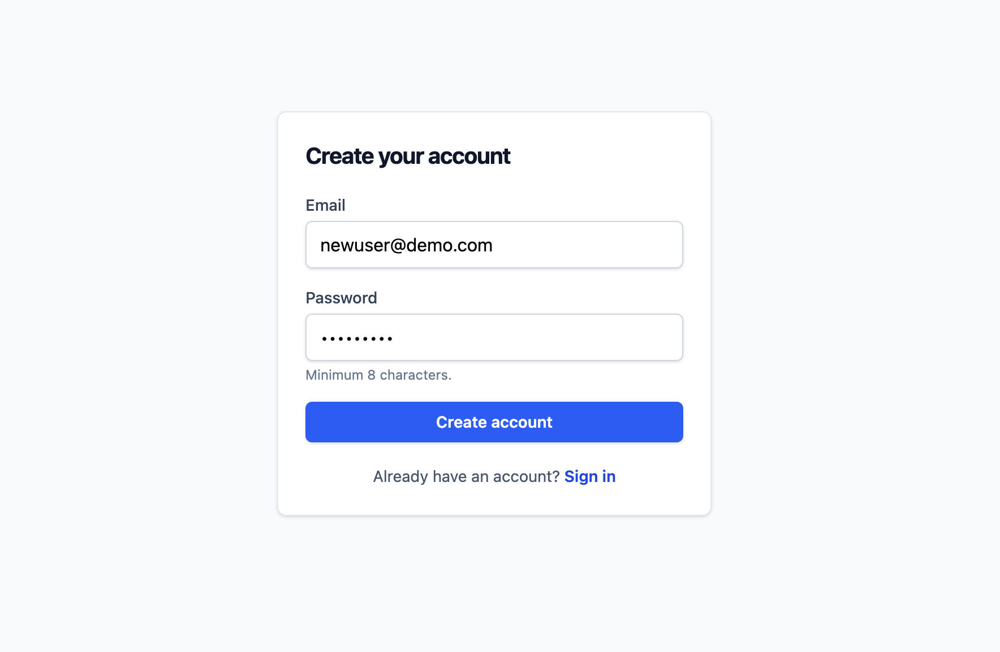
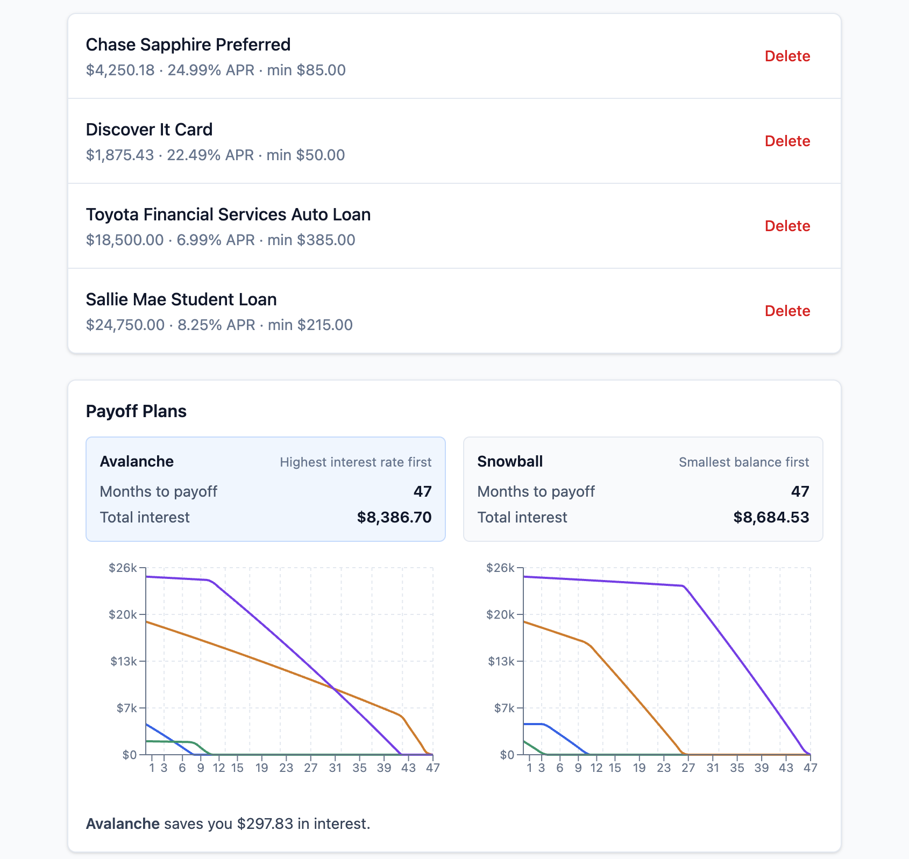
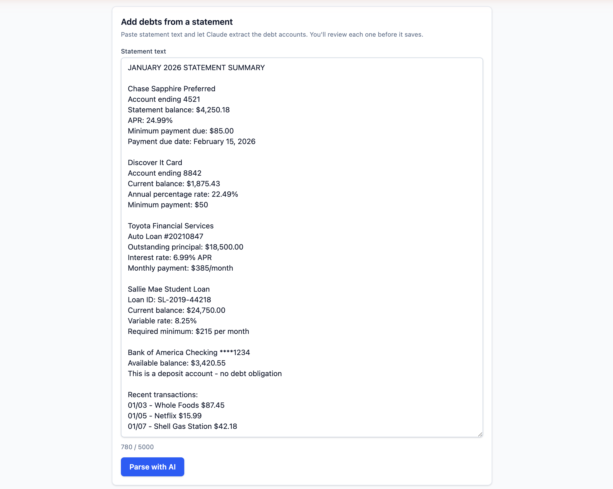
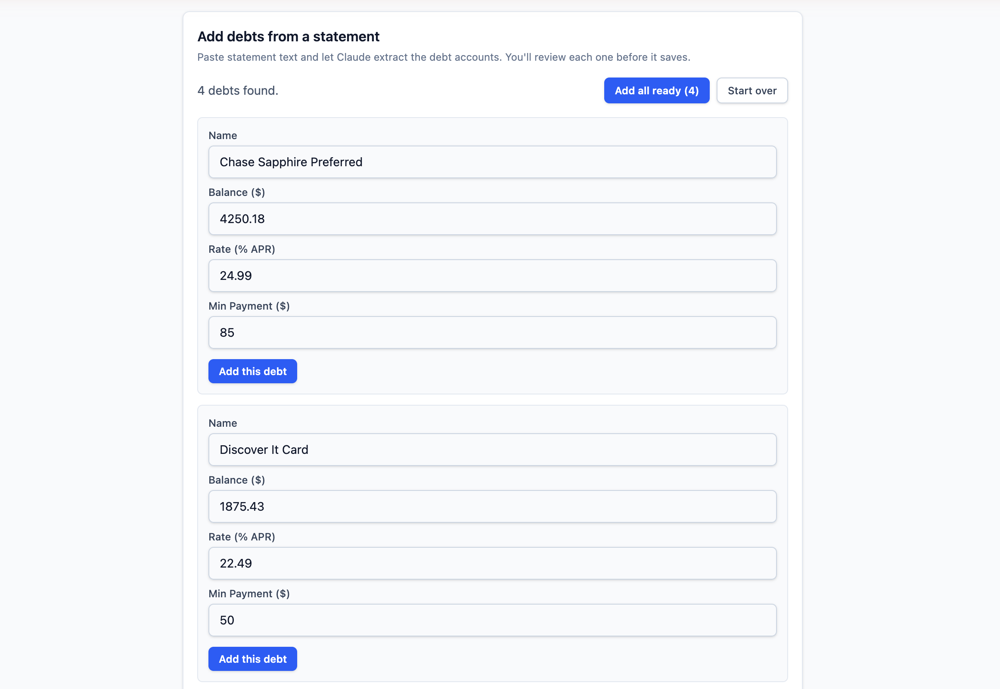
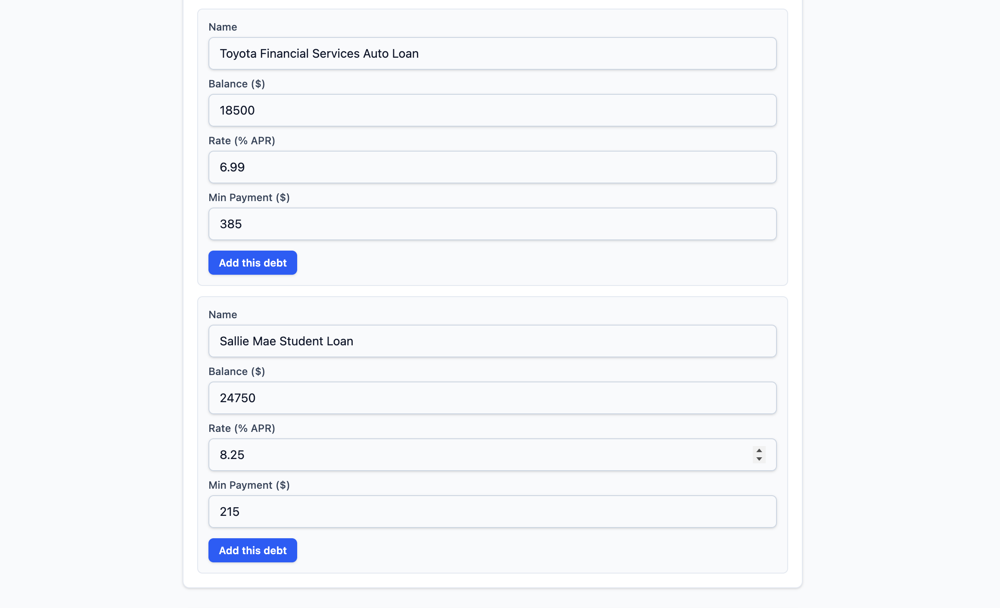
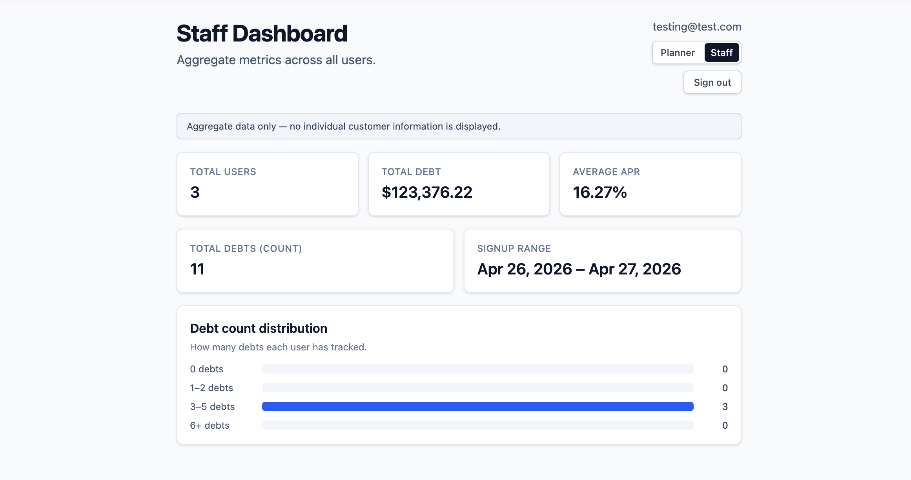
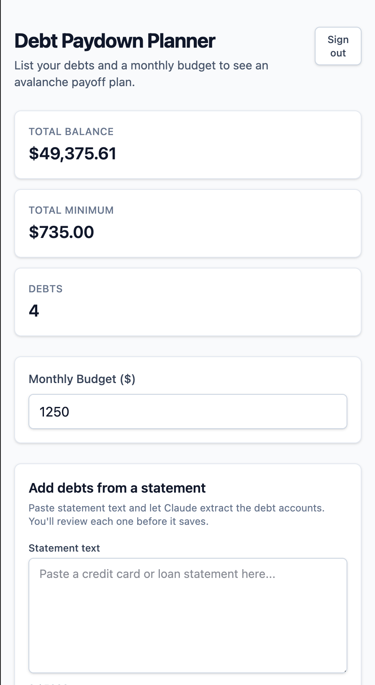

# Debt Paydown Planner

[](https://github.com/joekavanagh98/debt-paydown-planner/actions/workflows/ci.yml)

A consumer-facing web app for paying down debt by the avalanche
method (highest interest rate first). Given a list of debts and a
monthly budget, it computes a month-by-month payoff plan: minimum
payments on everything, extra cascading to the highest-rate debt,
and the next-highest as each one clears. Built as a self-directed
full-stack capstone on React, TypeScript, Node.js, Express,
MongoDB, and Tailwind CSS.

**Live demo:** [debt-paydown-planner.vercel.app](https://debt-paydown-planner.vercel.app/)

> The backend runs on Render's free tier, so the first request
> after a 15-minute idle window takes 30-50 seconds to wake the
> container. Subsequent requests are immediate.



## Tech stack

| Layer | Choice |
|---|---|
| Frontend | React 19, TypeScript strict, Tailwind CSS v4, Recharts, Vite |
| Backend | Node.js 22, Express 5, TypeScript strict, Zod, pino, helmet |
| Database | MongoDB Atlas (M0 free tier) via Mongoose |
| Auth | JWT (15-minute access tokens), bcrypt cost 12 |
| AI | Anthropic Claude (`claude-haiku-4-5`) via the official SDK with tool use |
| Tests | Vitest, supertest, mongodb-memory-server |
| Deploy | Vercel (frontend), Render Blueprint (backend) |
| Tooling | tsx watch (dev), ESLint, Prettier |

## Features

### Avalanche and snowball strategy comparison

Two payoff strategies side by side: avalanche (highest interest
rate first, provably interest-optimal) and snowball (smallest
balance first, motivational). Each strategy gets a per-debt
balance chart and a takeaway sentence quantifying the trade-off
in dollars and months.



### AI-assisted debt extraction

Paste a credit card or loan statement; Claude extracts the
structured debt fields (name, balance, APR, minimum payment) and
returns them as editable review cards. Three layers of
prompt-injection defense: delimiter-wrapped user input, hardened
system prompt, and review-before-save (the user has to click
"Add this debt" on each row before it persists).

| Input | Review |
|---|---|
|  |  |



### Staff dashboard

Role-gated view at `/staff`. Aggregate-only metrics across all
users: counts, total debt outstanding, average APR, signup range,
and a debt-count distribution histogram. The aggregate-only
invariant is enforced by a backend leak-canary test, not just the
frontend banner. Promotion to staff is a manual database
operation; see [docs/DEPLOY.md](docs/DEPLOY.md#5-promote-the-first-staff-user).



### Mobile-responsive layout

Mobile-first Tailwind utilities; everything from the strategy
charts to the AI extraction review works at phone widths.



### Other features

- **Per-user JWT auth** with bcrypt cost 12 and a dummy-hash
  defense on login (no email-enumeration timing oracle).
- **Per-user data scoping** on all `/debts` endpoints; one user
  cannot read or modify another's debts. Enforced at the service
  layer and verified by supertest cross-user isolation tests.
- **Rate limits** keyed appropriately per route: IP-keyed on the
  auth surface (5 per 15 min), userId-keyed on the AI extraction
  endpoint (10 per hour) since the cost is per-user.
- **Helmet security headers** including HSTS in production, CORS
  pinned to the deployed Vercel origin.
- **Centralized error handling** with a single JSON error
  envelope and an `AppError` taxonomy (`NotFoundError`,
  `ValidationError`, `UnauthorizedError`, `ForbiddenError`,
  `ConflictError`, `ExtractionError`). Stack traces never reach
  the client.
- **Integer-cents arithmetic** in the calculator. Balances are
  converted to integer cents before any compounding, then back to
  dollars in the output. Eliminates floating-point drift over
  schedules that can run 600+ months.
- **Discriminated union for calculator results.** The avalanche
  function returns either `{ feasible: true; schedule: ... }` or
  one of two failure variants keyed on a `reason` discriminant;
  consumers narrow before reading branch-specific fields.

## Version progression

The repo is structured as a sequence of self-contained apps, one
per version, so the progression of concepts is legible from the
commit history and from the directory tree. Each version's
`NOTES.md` records the design decisions and trade-offs in detail.

| Version | Stack | Demonstrates | Status |
|---|---|---|---|
| [v1](v1-vanilla/) | HTML, CSS, vanilla JS | Pure paydown math in integer cents, hand-rolled test harness, event delegation, graceful-degradation storage | Complete |
| [v2](v2-react/) | React, Vite | Feature-based component structure, lifting state, controlled inputs, `useMemo`, lazy initial state, functional setters | Complete |
| [v3](v3-typescript/) | TypeScript strict | Shared types module, discriminated union for the calculator's result, typed props and event handlers, `noUncheckedIndexedAccess` opt-in | Complete |
| [v4](v4-tailwind/) | Tailwind CSS v4, Recharts | CSS-first Tailwind config, mobile-first responsive layout, avalanche and snowball comparison with per-debt balance charts, Vercel deploy config | Complete |
| [v5](v5-backend/) | Express 5, TypeScript, Zod | Layered backend (routes/controllers/services), centralized error handling and JSON error envelope, Zod request validation, env config validated at boot, pino + morgan logging, CORS, supertest end-to-end tests | Complete |
| [v6](v5-backend/) | MongoDB Atlas, Mongoose | Persistent storage in v5-backend (in-place modification), UUID `_id`, mongodb-memory-server for tests, graceful shutdown, schema/type consolidation via `z.infer` | Complete |
| [v7](v5-backend/) | JWT, bcrypt, helmet, express-rate-limit | JWT auth in v5-backend (in-place modification), bcrypt hashing with constant-time-ish login defense, per-user scoped debts, helmet security headers, IP-based rate limiting on auth endpoints, CORS array form | Complete |
| [v8](v5-backend/) | Render + Vercel + Anthropic SDK | Render Blueprint backend deploy and Vercel frontend deploy, Claude-backed debt extraction from pasted statements via tool use, three-layer prompt-injection defense (delimiter wrap, prompt hardening, review-before-save), per-user rate limit, role-gated staff dashboard with aggregate-only metrics and a leak-canary test enforcing the privacy invariant | Complete |

## Architecture

For the integrated system view (Mermaid diagram, request-flow
walkthroughs, data model, security model, error taxonomy, and
the consolidated future-work list across all versions), see
[docs/architecture.md](docs/architecture.md).

Highlights:

- **Layered backend.** Routes delegate to controllers,
  controllers to services, services to models. Business logic
  lives in services so it's testable without HTTP plumbing. Zod
  validation runs as its own layer in front of every controller.
  v6's storage swap (in-memory Map → Mongoose) didn't touch
  routes, validators, controllers, or the error handler.
- **Configuration via environment, validated at boot.** `env.ts`
  is the only file that reads `process.env`; a Zod schema
  validates the whole environment at module load. Missing or
  malformed values fail the process before binding the port.
- **Auth as middleware, not a service-level concern.**
  `requireAuth` and `requireStaff` gate entire routers.
  Controllers don't know auth exists; they read `req.userId`.
  The same pattern keeps the staff dashboard's RBAC isolated
  from the aggregation logic it protects.
- **Aggregate-only invariant for staff data.** `/staff/summary`
  is enforced aggregate-only by a leak-canary test: a user is
  seeded with random-UUID-derived canary tokens, the endpoint is
  hit as a staff caller, and the entire response body is
  string-searched for the canary. Any field that accidentally
  surfaces individual data fails the test before merge.

## Running locally

Each version is standalone; v6/v7/v8 modify v5-backend in place.

**v1** (vanilla, no install):

```sh
open v1-vanilla/index.html
```

**v2 / v3** (Vite dev server):

```sh
cd v2-react    # or v3-typescript
npm install
npm run dev
```

**v4** (frontend only, talks to a deployed or local backend):

```sh
cd v4-tailwind
npm install
echo 'VITE_API_URL=http://localhost:3001' > .env.local
npm run dev      # http://localhost:5173
```

**v5/v6/v7/v8** (full stack: frontend + backend + Atlas):

```sh
# Backend
cd v5-backend
npm install
cp .env.example .env
# Fill in MONGODB_URI, JWT_SECRET (>= 32 chars),
#         ANTHROPIC_API_KEY, CORS_ORIGIN
npx tsx watch --env-file=.env src/server.ts   # http://localhost:3001
```

```sh
# Frontend (in a second terminal)
cd v4-tailwind
npm install
npm run dev                                    # http://localhost:5173
```

For deploying the v8 stack to Render and Vercel, see
[docs/DEPLOY.md](docs/DEPLOY.md).

## Tests

```sh
cd v5-backend && npm test    # 55 tests across calculator,
                             # services, and supertest end-to-end

cd v4-tailwind && npm test   # 16 calculator tests
                             # (component tests deferred to v9+)
```

## Why I built this

Self-directed full-stack capstone on a stack I wanted hands-on
practice with end-to-end (React, TypeScript, Node, Express,
MongoDB, Tailwind). Debt paydown was a deliberate domain pick:
the math has natural constraints (integer-cents arithmetic,
schedules that can run 600+ months, two strategies with
provably different optima) that force the engineering work to
be more than decoration. The brief was to ship something a real
person could actually use, with the engineering discipline I'd
want a teammate to bring: layered architecture, validation as
its own layer, centralized error handling, structured logging,
environment-validated config, and tests at every layer.

## What I learned

Five reflections that earned their place on this project, in no
particular order.

**Integer-cents arithmetic for financial math is non-negotiable
once schedules get long.** v1 was where I hit this. Floating-
point drift compounds across 600-month schedules and shows up
as off-by-a-penny end balances that don't actually round to
zero. Converting to integer cents at the boundary, doing all the
math in cents, converting back at the output is one extra
function on each side and removes a whole class of bug.

**Layered architecture pays off the day you swap a layer.** I'd
read the case for routes/controllers/services/models a dozen
times. v5 was a fresh in-memory backend with the layers wired up
"correctly" but the value was theoretical. v6 swapped the in-
memory Map for Mongoose and routes, controllers, validators, and
the error handler did not move. That was the first time the
trade felt real, not memorized.

**Strict TypeScript flags up front beat retrofitting.** v3
turned on `noUncheckedIndexedAccess` and
`exactOptionalPropertyTypes` before any code landed. Both flagged
real bugs that would have shipped (Recharts' `string | undefined`
return on indexed lookups, fetch's body-must-not-be-undefined
under `exactOptionalPropertyTypes`). Retrofitting these flags
later means fighting every existing call site.

**LLM tool use is meaningfully different from prompt-only JSON.**
"Ask the model for JSON" sounds like the structured-output
story, but it drifts: extra keys, wrong types, prose mixed in.
Tool use forces the model into a `tool_use` payload constrained
by the API's `input_schema`, and Zod-parsing the result adds
defense-in-depth on top. v8's extraction endpoint is one
explicit `tool_choice` plus one Zod schema, not a JSON-extraction
parser hardened against a model that wants to chat.

**Aggregate-only invariants need a test, not a banner.** The
staff dashboard has both. The banner ("Aggregate data only - no
individual customer information is displayed") is a soft check;
it doesn't inspect the response. The load-bearing guarantee is
a backend test that seeds a user with random canary tokens, hits
`/staff/summary` as a staff caller, and asserts the canary
strings don't appear anywhere in the response body. The banner
can't answer "what if a future field accidentally surfaces
individual data"; the canary can.

## Project documents

- [CLAUDE.md](CLAUDE.md) - project context, version roadmap,
  code-quality expectations, and the rules for how AI assistance
  is used (and not used) in this repo.
- [docs/architecture.md](docs/architecture.md) - integrated
  system view across all eight versions.
- [docs/DEPLOY.md](docs/DEPLOY.md) - production deploy guide
  for Render + Vercel + Atlas, with gotchas and troubleshooting.
- `NOTES.md` inside each version folder - version-specific
  learning notes and a "what could be better" section tracking
  known gaps.

## Author

Joe Kavanagh.

[GitHub](https://github.com/joekavanagh98) ·
[Live demo](https://debt-paydown-planner.vercel.app/)
