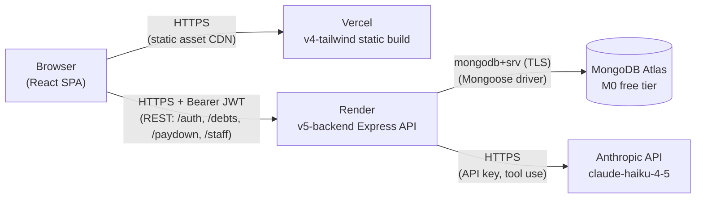

# Architecture

The integrated system view across all eight versions. Each
version's NOTES.md covers the version-specific decisions and
trade-offs; this document is what they add up to in the deployed
v8 product.

## System diagram



Three external services, one repo, four versioned codebases that
ship into two deploys (frontend on Vercel, backend on Render).
Atlas and Anthropic are external SaaS endpoints; neither is
self-hosted.

## Frontend layout (v4-tailwind)

```
src/
  features/
    auth/           - AuthGate, AuthForm, AuthProvider, authContext, useAuth
    debts/          - DebtForm, DebtList, DebtExtractor, BudgetInput,
                      Summary, StrategyComparison
    staff/          - StaffDashboard
  lib/
    api.ts          - fetch wrapper, JWT header injection, 401 handler
    debtsApi.ts     - typed wrappers for /debts
    staffApi.ts     - typed wrapper for /staff/summary
  utils/
    paydownCalculator.ts - pure avalanche/snowball math (ported from v3)
    formatMoney.ts, storage.ts
  types/index.ts    - duplicated contracts from v5-backend
  App.tsx           - auth gate plus view-switch (planner vs staff)
```

Auth state lives in React context. UI state (form submit-in-flight,
error messages) lives next to the form that owns it. Token sits in a
module-scope variable in `lib/api.ts`, never touches localStorage.
Budget is the one piece of per-user UI prefs in localStorage,
namespaced by user id. See `v4-tailwind/NOTES.md` § "v8 Phase 1"
for the trade-offs.

## Backend layout (v5-backend, modified through v8)

```
src/
  routes/           - URL plus verb plus controller; no logic
  controllers/      - embedded inside routes for the small surface
  middleware/       - requireAuth, requireStaff, validate (Zod factory),
                      rateLimit (auth + extraction), errorHandler,
                      requestLogger
  services/         - paydown, debts, auth, extraction, aggregate
  models/           - Mongoose schemas: user.model, debt.model
  validators/       - Zod schemas mirrored at the API boundary
  errors/           - AppError taxonomy
  config/env.ts     - Zod-validated env, single source of truth
  app.ts / server.ts - split so tests can buildApp() without a port
```

Routes call services. Services own business logic and never see
`req`/`res`. Controllers stay trivially mockable. Models are the
persistence boundary; Mongoose calls live there only. Zod runs as
its own layer in front of every controller.

## Request flow: add a debt

User submits DebtForm. Browser sends `POST /debts` with the new
debt body and `Authorization: Bearer <jwt>`.

1. **CORS**. Origin checked against `env.CORS_ORIGIN` (array form).
   Mismatches reject before any handler runs.
2. **Helmet**. Sets security headers on the eventual response
   (HSTS in prod, content-type, frame, etc).
3. **Morgan**. Logs the request line through pino's stream.
4. **`requireAuth`**. Verifies the JWT signature with
   `env.JWT_SECRET`, extracts `userId` from the payload, attaches
   to `req.userId`. 401 if missing, malformed, or expired.
5. **`validate("body", newDebtSchema)`**. Strict Zod schema.
   Returns 400 with the issues array if shape is wrong.
6. **`postDebt` controller**. Calls
   `debts.service.createDebt({...input, userId: req.userId})`.
7. **`debts.service.createDebt`**. `DebtModel.create(...)`.
   UUID `_id` generated by the model's `default: () => randomUUID()`.
8. **Mongoose → Atlas**. Single insert, returns the persisted doc.
9. **Response**. Controller maps `_id → id` via `toDebt()` and
   sends 201.

The frontend updates the cached debts list optimistically from the
201 body; nothing else needs invalidation.

## Request flow: AI debt extraction

User pastes statement text into `DebtExtractor`, clicks "Parse
with AI." The endpoint extracts but never persists; the user
reviews each extracted debt and saves them through the same
`createDebt` flow above.

1. **`POST /debts/extract`** with body `{ text }` and bearer JWT.
2. CORS, helmet, morgan as above.
3. **`requireAuth`** validates the JWT.
4. **`extractionRateLimit`**. 10 per hour, keyed on `req.userId`.
   429 if exceeded.
5. **`validate("body", extractRequestSchema)`**. Text is non-empty
   and ≤ 5000 chars.
6. **`extraction.service.extractFromText(text)`**:
   - Wraps the text in `<statement>` tags (delimiter defense).
   - Calls Anthropic with a system prompt that names the
     delimiter as data, plus a `save_debts` tool definition with
     a JSON schema, plus
     `tool_choice: { type: "tool", name: "save_debts" }` to force
     a structured response.
   - Receives a `tool_use` block, extracts the input payload.
   - Zod-parses the payload (`extractedDebtSchema`) as
     defense-in-depth on top of the API's `input_schema`.
   - Returns `{ debts: ExtractedDebt[] }`.
7. Controller sends 200 with the result. **Nothing persisted.**
8. Frontend renders the result as editable review cards.
9. User clicks "Add this debt" on each row (sequentially, not in
   parallel; see `v4-tailwind/NOTES.md` § "Sequential saves").
   Each save runs the full add-a-debt flow above.

Three layers of prompt-injection defense work together:

- Layer 1 (delimiter wrap) and Layer 2 (system-prompt hardening)
  live in `extraction.service`.
- Layer 3 (review-before-save) is structural: the endpoint
  literally cannot write to Mongo. Even if the model fabricates a
  debt, the user has to click to add it.

See `v5-backend/NOTES.md` § "Prompt-injection defense" for the
threat model.

## Data model

### User

```ts
{
  _id: string,            // UUID
  email: string,          // unique, lowercase, validated by Zod
  passwordHash: string,   // bcrypt cost 12
  role: "user" | "staff", // default "user"
  createdAt: Date,        // Mongoose timestamp
  updatedAt: Date,
}
```

`toUserPublic()` strips `passwordHash` and remaps `_id → id`
before any response. The login endpoint returns `{ user, token }`;
the user object is the public view.

### Debt

```ts
{
  _id: string,            // UUID
  userId: string,         // FK to User._id; required, indexed
  name: string,           // max 40 chars
  balance: number,        // ≥ 0
  rate: number,           // ≥ 0; APR as percent (24, not 0.24)
  minPayment: number,     // ≥ 0; 0 means "no explicit minimum"
  createdAt: Date,
  updatedAt: Date,
}
```

`toDebt()` strips `userId` from the API response (the client
already knows whose debts these are; sending it back is noise) and
remaps `_id → id`.

### Per-user scoping

Every debt query in `debts.service` includes
`userId: req.userId`. Cross-user reads are blocked at the service
layer, not at the model. The trade-off:

- Service-layer scoping keeps the model schema simple and the
  scoping rule visible at the call site.
- A misconfigured route that forgot to pull `userId` would leak
  across users. The lint that prevents this is small surface
  (six service functions) plus the supertest cross-user
  isolation tests in `app.test.ts`.

Aggregate read paths (`/staff/summary`) deliberately don't scope
by userId because the staff caller is asking for system-wide
totals. The aggregate-only invariant is enforced by a separate
test (see "Security model" below).

## Security model

Defense layers from the outside in.

| Layer | Scope | Where |
|---|---|---|
| CORS array allowlist | Cross-origin gate | `app.ts` |
| Helmet headers | HSTS, frame, content-type | `app.ts` |
| Auth rate limit | 5 per 15 min per IP | `/auth/*` |
| `requireAuth` | JWT validation | `/debts`, `/paydown`, `/staff` |
| Extraction rate limit | 10 per hour per userId | `/debts/extract` |
| `requireStaff` | Role check on fresh DB read | `/staff/*` |
| Per-user data scoping | service-layer userId filter | `debts.service` |
| Aggregate-only invariant | leak canary test | `/staff/summary` |

### Auth

- **bcrypt cost 12** on register and login. ~250ms per hash on a
  modern laptop.
- **Dummy-hash defense**. Login runs `bcrypt.compare` against a
  fixed dummy hash when the email isn't found, so the no-such-user
  branch takes the same wall-clock time as the wrong-password
  branch. Removes the timing oracle.
- **JWT, 15-minute expiration**. Access tokens only; no refresh.
  See `v5-backend/NOTES.md` § "No refresh tokens (deliberate)" for
  the deferral rationale.
- **In-memory token storage** in the frontend. A page refresh
  logs the user out. Trade-off detailed in
  `v4-tailwind/NOTES.md` § "Token storage: in-memory only".
- **HTTPS** enforced by Render and Vercel; helmet adds HSTS in
  production.

### Rate limits

- `authRateLimit`: 5 per 15 min, keyed on IP. Returns 429 with the
  standard error envelope. Skipped in test mode.
- `extractionRateLimit`: 10 per hour, keyed on `req.userId`.
  Cost-pegged to the model spend per user. Skipped in test mode.

Both run before the controller, so a 429 never touches a service.

### Authorization

- `requireAuth` is the user gate. JWT signature plus expiration.
- `requireStaff` is the role gate. Reads the role fresh from
  Mongo on every request rather than off the JWT payload, so
  demotion takes effect without waiting for the token to expire.
  See `v5-backend/NOTES.md` § "Why fresh DB lookup in
  requireStaff."

### Aggregate-only invariant

`/staff/summary` returns user counts, debt totals, average APR,
signup range, and a debt-count distribution. Nothing identifies
an individual user.

The invariant is enforced by a leak canary test in `app.test.ts`:
a user is seeded with a unique random-UUID-derived email and debt
name, the endpoint is hit as a staff caller, and
`JSON.stringify(res.body)` is searched for any of the canary
tokens. If a future field accidentally surfaces individual data,
the test fails before merge. The frontend banner ("Aggregate data
only...") is a soft check; the canary test is the load-bearing
guarantee.

## Error handling

`AppError` is the base class for any error the API intentionally
surfaces to the client. The error-handler middleware checks
`instanceof AppError` and renders `{ statusCode, code, message }`
(plus an `issues` array for `ValidationError`). Anything not
extending `AppError` logs the underlying error server-side and
returns a generic 500 envelope; the actual message never reaches
the client.

| Class | Status | Code | Used by |
|---|---|---|---|
| `NotFoundError` | 404 | `not_found` | unmounted routes, missing resources |
| `ValidationError` | 400 | `validation_error` | Zod failures (carries issues) |
| `UnauthorizedError` | 401 | `unauthorized` | `requireAuth`, login |
| `ForbiddenError` | 403 | `forbidden` | `requireStaff` |
| `ConflictError` | 409 | `already_exists` | `/auth/register` for duplicate email |
| `ExtractionError` | 502 | `extraction_failed` | upstream LLM returned unparseable output |

One envelope shape across every failure mode. The frontend's
`ApiRequestError` carries the same `code` field, which the per-
screen `messageFor()` helpers map to user-facing copy.

Express 5 propagates async rejections to the error handler
automatically, so controllers don't need `try/catch` around their
service calls.

### What never reaches the client

- Stack traces (logged server-side via pino).
- Underlying database errors (mongoose, network, etc).
- Anthropic SDK error objects (mapped to `ExtractionError` at the
  service boundary).
- Internal config validation messages (process exits at boot
  before serving any traffic).

## Configuration

`src/config/env.ts` is the only file that reads `process.env`. A
Zod schema validates the whole environment at module load. If
anything is missing or malformed, the process exits with a
diagnostic before binding the port.

Required at boot: `PORT`, `NODE_ENV`, `JWT_SECRET` (≥ 32 chars),
`MONGODB_URI`, `ANTHROPIC_API_KEY`, `CORS_ORIGIN`, `LOG_LEVEL`.
Defaults cover dev (`PORT=3001`, `LOG_LEVEL=debug`,
`NODE_ENV=development`, `CORS_ORIGIN=http://localhost:5173`); prod
overrides every one through Render's environment dashboard.

See `docs/DEPLOY.md` for the production env-var checklist.

## Logging

Pino is the only application logger. Production emits one JSON
line per log; development pipes through pino-pretty for human-
readable output. Morgan handles request access logs through a
custom stream that feeds each line to `logger.info()`, so request
logs and app logs land on the same stdout in the same shape.

The current gap: no request-id correlation across access log,
app log, and error log. Documented in
`v5-backend/NOTES.md` § "What could be better".

## Testing

| Suite | File | Count | What it covers |
|---|---|---|---|
| Calculator | `paydownCalculator.test.ts` | 16 | Pure paydown math (avalanche, snowball, edge cases) |
| Paydown service | `paydown.service.test.ts` | 2 | Strategy dispatch |
| Debts service | `debts.service.test.ts` | 5 | Mongoose CRUD against memory-server |
| Extraction service | `extraction.service.test.ts` | ~6 | Anthropic SDK mocked at the class boundary |
| App (supertest) | `app.test.ts` | ~26 | End-to-end through every middleware and route |

`mongodb-memory-server` runs an ephemeral Mongo per test file;
`afterEach` clears every collection. The supertest suite never
opens a TCP port. Total run is around three seconds. Backend
total: 55 tests at the v8 Phase 4 mark.

## Future work

Each version's NOTES.md tracks its own gap list. Pulling them
together:

### Auth and security
- Refresh tokens (`v5-backend/NOTES.md` § "No refresh tokens")
- Account-based lockout in addition to IP-keyed limits
  (`v5-backend/NOTES.md` § "IP-based rate limit")
- Password reset and email verification (deferred until an email
  channel exists)
- Per-staff permission scopes; today is binary user/staff
  (`v5-backend/NOTES.md` § "What v8 Phase 4 still does not do")

### Observability
- Request-id correlation across access log, app log, and error
  log (`v5-backend/NOTES.md` § "No request id"; carried forward
  through v6/v7/v8)
- Audit log for staff endpoint access
  (`v5-backend/NOTES.md` Phase 4)
- Per-user cost telemetry on `/debts/extract`

### Data plane
- Database-name unification between dev and prod
  (`v5-backend/NOTES.md` § "Database name mismatch")
- Atlas allowlist tightened off `0.0.0.0/0` once Render's egress
  IPs are static (`docs/DEPLOY.md` and `v5-backend/NOTES.md`)
- Type duplication between frontend and backend (workspaces,
  OpenAPI codegen, or tRPC; see `v4-tailwind/NOTES.md` § "Type
  duplication")

### Extraction
- PDF and image upload (vision API or OCR pre-step)
  (`v5-backend/NOTES.md` § "What v8 Phase 3 still does not do")
- Streaming the tool-call response
- Re-prompt on bad output instead of immediate `ExtractionError`
- Delimiter escaping for `</statement>` collisions

### Frontend
- Live role-change refresh (websocket or `/auth/me` poll)
  (`v4-tailwind/NOTES.md` Phase 4)
- Persisted view-switch across refresh
- Component test coverage; only the calculator is unit-tested
  today (`v4-tailwind/NOTES.md` § "Still no component tests")
- Dark mode (`v4-tailwind/NOTES.md` § "No dark mode")
- Form accessibility gaps (`aria-describedby`, focus management,
  `aria-invalid`) (`v4-tailwind/NOTES.md` § "AuthForm
  accessibility posture")

### Staff dashboard
- Signup-range precision degrade (month-granularity or
  threshold-gating) before any non-developer signup flow opens
  (`v5-backend/NOTES.md` § "Signup-range precision tradeoff")

The list is large because the project is small. Every gap above
has an explicit owner-version-NOTES entry; nothing is hidden.
